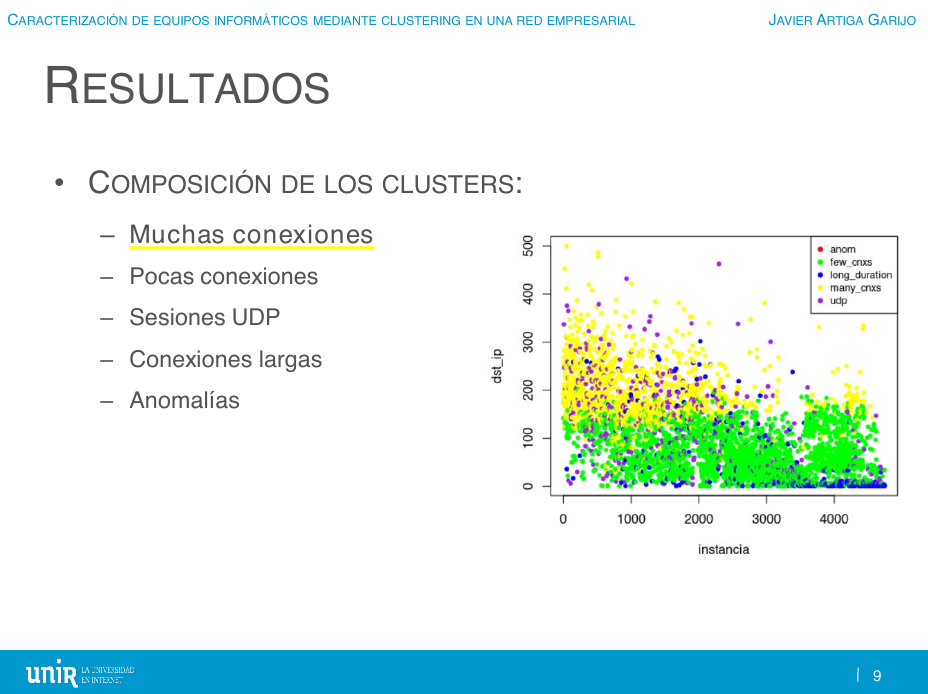
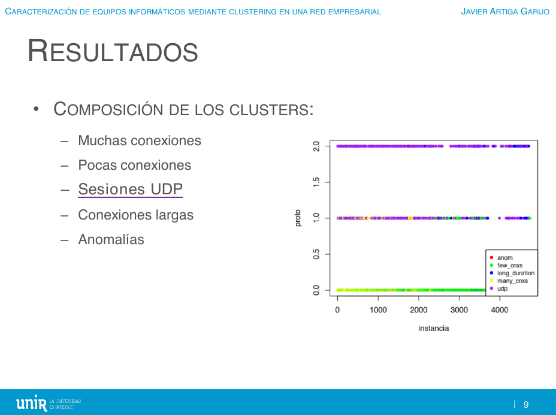
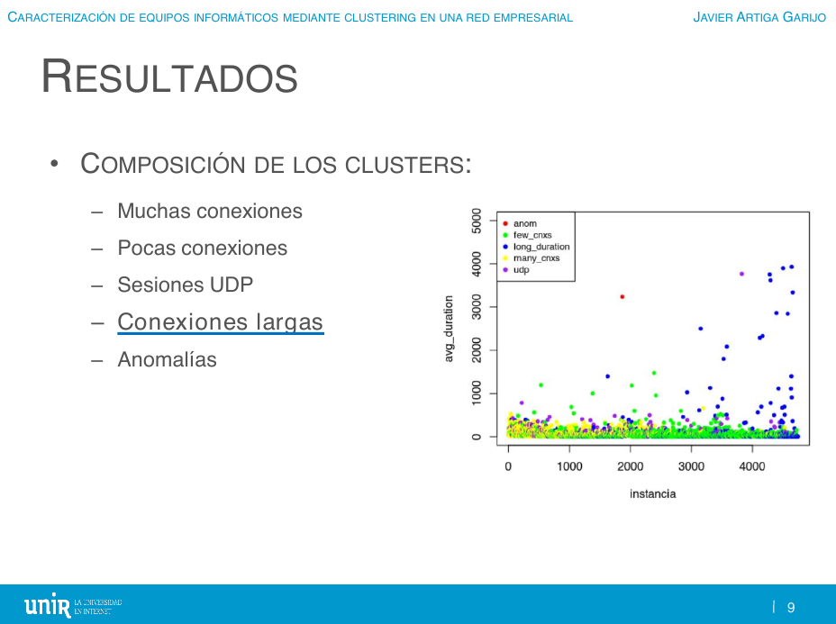
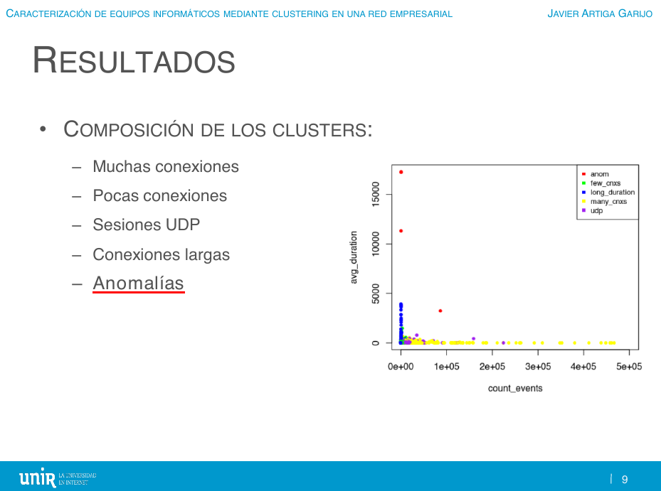

tfm-clustering
==============================

caracterización de equipos informáticos mediante clustering en una red empresarial

Organización del repositorio
------------

    ├── Makefile           <- Makefile with commands like `make data` or `make train`
    ├── README.md          <- The top-level README for developers using this project.
    ├── data
    │   ├── external       <- Data from third party sources.
    │   ├── interim        <- Intermediate data that has been transformed.
    │   ├── processed      <- The final, canonical data sets for modeling.
    │   └── raw            <- The original, immutable data dump.
    │
    ├── docs               <- A default MkDocs project; see mkdocs.org for details
    │
    ├── models             <- Trained and serialized models, model predictions, or model summaries
    │
    ├── references         <- Data dictionaries, manuals, and all other explanatory materials.
    │
    ├── reports            <- Generated analysis as HTML, PDF, LaTeX, etc.
    │   └── figures        <- Generated graphics and figures to be used in reporting
    │
    ├── requirements.txt   <- The requirements file for reproducing the analysis environment, e.g.
    │                         generated with `pip freeze > requirements.txt`
    │
    ├── setup.py           <- Make this project pip installable with `pip install -e`
    └── src                <- Source code for use in this project.
        ├── data           <- Scripts to download or generate data
        │   └── make_dataset.py
        │
        ├── features       <- Scripts to turn raw data into features for modeling
        │   └── build_features.py
        │
        ├── models         <- Scripts to train models and then use trained models to make predictions
        │   ├── predict_model.py
        │   └── train_model.py
        │
        └── visualization  <- Scripts to create exploratory and results oriented visualizations
            └── visualize.py

--------

# Resultados

**1**. En los equipos que corresponden a la categoría "**comportamiento normal con muchas conexiones**", el número de direcciones IPs destino únicas a las que se conectan está en el orden de varios cientos y casi siempre 2 puertos destino (los más frecuentes, 80 y 443) o 3.

⠀

**2**. Los equipos de categoría "**comportamiento normal, pocas conexiones**" se conectan a decenas de IPs destino, usando menos de 100 puertos origen y hacia 1-2 puertos destino.

⠀

**3**. En los clasificados como "**sesiones UDP**" lo más destacado es que la característica "protocolo" es mayor que 1, lo que significa que se usa UDP de forma notable (a diferencia de las categorías de comportamiento normal anteriores, donde este valor es más cercano a 0). También suele haber más de 2 puertos destino y las sesiones son más largas de media que las de las categorías anteriores.

⠀

**4**. La cuarta categoría suele identificarse como "**conexiones largas**" porque la duración media de sesión está en el orden de decenas e incluso centenas de miles de segundos (esto es, mantienen sesiones que superan el día de duración).

⠀

**5**. En el grupo denominado de las "**anomalías**", los valores son más extraños porque se compone de pocas instancias cuyas características son más extremas. Lo que más salta a la vista es que el número de eventos en estos casos es mucho mayor, y también el número de puertos origen (lo que indica que estos equipos mantienen una cantidad de sesiones mayor que el resto).

<small>Project based on the <a target="_blank" href="https://drivendata.github.io/cookiecutter-data-science/">cookiecutter data science project template</a>. #cookiecutterdatascience</small>

